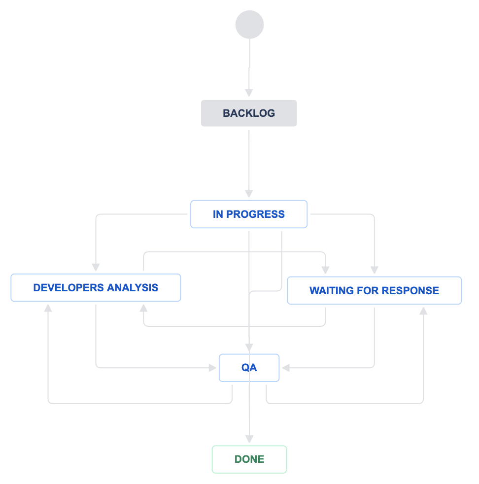

## Workload and performance.

### Dealing with data from a Jira project and creating visualizations for a performace and workload report.
The idea of this project is to obtain a weekly report about how much workload is every person in the team taking.  
I'll be using **Plotly** library to create the data visualizations we want.

#### Things to keep in mind:
**Teams:**
Because of matters of language and workload, the current team covers different countries:
* **BRAZIL**: BRAZIL.
* **MEXICO**: MEXICO, COSTA RICA, ECUADOR.
* **COLOMBIA**: COLOMBIA, ARGENTINA, CHILE, URUGUAY, PERU.  

**Workers:**
* Roberto Rosas - MX
* Rafael Cordeiro - BR
* Vitor Marra - BR
* Carla Dornellas -BR
* Roberto Giron - CO
* Francisco Silva - MX
* Vitor Giraldo - CO

**Requests:**  
Every requests means there is something to take care of. There are requests about troubleshooting (there is a problem and needs to be solved), others just about adding data to the DB, updating or changing tasks and other categories.  

**Performace:**  
Let's define our performance metric as the count of requests that the worker has been solving.

**Workflow:**  
<div>

</div>

* **Backlog:** The task hasn't been started yet.
* **In progress:** The task is on process.
* **Developers analysis:** Task needs hands on of the developers team.
* **Waiting for response:** In order to solve the issue, more information is needed from the reporter.
* **QA:** Time to validate that the given solution was accurate.
* **Done:** Issue or task solved.

### About the data:
The data I'm using in this project is downloaded directly from our Jira project using **Jira** module. Because of that same reason, I'm only loading the datasets obtained on July 4th.   
This data has already been cleaned up and manipulated for security reasons.  
There are two datasets:
* **Jira_data.csv**: Data with all information extracted from Jira.
* **Jira_data_filter.csv**: Filtered data with only the steps we need of the workflow.

The project was started on *2020-05-28*.

### Objective:

There are several things that could be interesting for us from this data, but I'll only be focusing on this points:
* **Workload:**
    * Amount of weekly requests vs solved.
    * Workload by country over the time.
    * Workload by country current week.
    * Are there any requests from passed weeks that haven't been solved yet and what is the actual status?
    * Amount of requests of each week by type of request, the current total and the total of each week.
    * Current workload by worker.  
    
* **Performance:**   
    * Let's define our performance metric as the count of requests that the worker has been solving. What is the performace of each worker then?
* **General insights:**    
    * How much time do we spend in each part of the flow process?
    * What are the causes of our problems and in what measure?


```python

```
